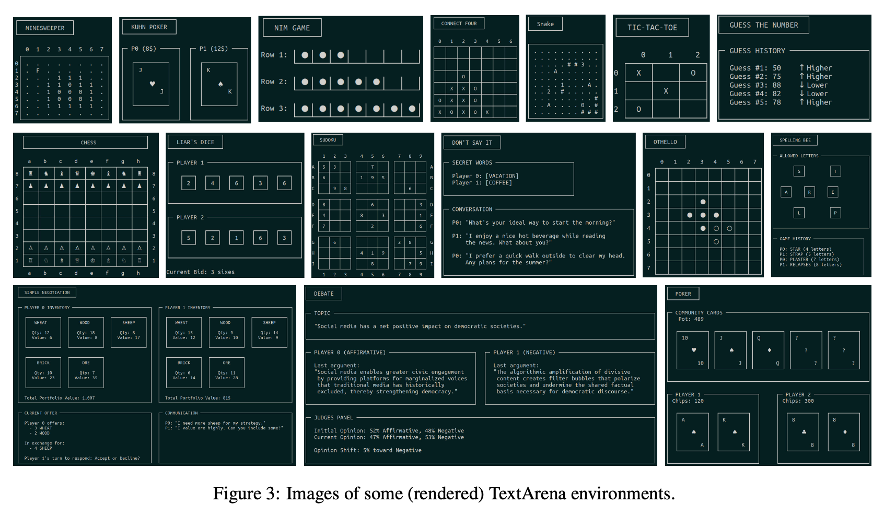

# Awesome AI in Game <!-- omit in toc -->

**Note:** A daily compilation of fascinating AI insights, perfect for enhancing game development or gameplay to meet personal requirements. 🎮🤖 (Generated by Microsoft Copilot 😊)

**Feel free to open an issue or shoot me an email if you come across any interesting papers, projects, researchers, or if you find that my understanding is not correct.**

## Table of Contents <!-- omit in toc -->
- [Leadboard](#leadboard)
- [Paper](#paper)
  - [Survey](#survey)
  - [Game Making](#game-making)
    - [Animation](#animation)
      - [Survey](#survey-1)
      - [Physics-Based](#physics-based)
      - [Kinematics](#kinematics)
  - [Game Environment](#game-environment)
    - [PCG](#pcg)
    - [Playable Video Generation](#playable-video-generation)
  - [Game Agent](#game-agent)
    - [Text-based](#text-based)
    - [FPS](#fps)
  - [Misc](#misc)
- [Environment](#environment)
  - [RPG](#rpg)
- [Project](#project)
  - [LLM](#llm)

## Leadboard
| Title     | Date        | Links                                                                             | Summary                                                                | Visualization                                           | Remarks |
| --------- | ----------- | --------------------------------------------------------------------------------- | ---------------------------------------------------------------------- | ------------------------------------------------------- | ------- |
| TextArena | 15 Apr 2025 | [Arxiv](https://arxiv.org/abs/2504.11442) [Website](https://www.textarena.ai/) | TextArena is an open-source collection of competitive text-based games |  | -       |

## Paper
### Survey
> [!NOTE]
> **Highlight Authors**
> - Julian Togelius [Homepage](http://julian.togelius.com/) [Google Scholar](https://scholar.google.com/citations?user=lr4I9BwAAAAJ&hl=en)

| Title                                                 | Date        | Links                                        | Summary | Visualization | Remarks |
| ----------------------------------------------------- | ----------- | -------------------------------------------- | ------- | ------------- | ------- |
| Large Language Models and Games: A Survey and Roadmap | 28 Feb 2024 | [Arxiv](https://arxiv.org/html/2402.18659v1) | -       | -             | -       |

### Game Making
#### Animation
> [!NOTE]
> **Highlight Authors**
> - Xue Bin (Jason) Peng [Homepage](https://xbpeng.github.io/) [Google Scholar](https://scholar.google.ca/citations?user=FwxfQosAAAAJ&hl=en)
> - Michiel van de Panne [Homepage](https://www.cs.ubc.ca/~van/) [Google Scholar](https://scholar.google.ca/citations?user=lJwPbcUAAAAJ&hl=en)
> - C. Karen Liu [Lab Page](https://tml.stanford.edu/) [Google Scholar](https://scholar.google.com/citations?user=i28fU0MAAAAJ&hl=en)
> - Zhaoming Xie [Homepage](https://zhaomingxie.github.io/) [Google Scholar](https://scholar.google.ca/citations?user=qDsqFkMAAAAJ&hl=en)
> - Sebastian Starke [Homepage](https://www.sebastianxstarke.com/) [Google Scholar](https://scholar.google.com/citations?user=ScpOkvAAAAAJ&hl=en) **Super cool Homepage!!!**

##### Survey
| Title                                                             | Date       | Links                                     | Summary | Visualization | Remarks |
| ----------------------------------------------------------------- | ---------- | ----------------------------------------- | ------- | ------------- | ------- |
| A Survey on Reinforcement Learning Methods in Character Animation | 7 Mar 2022 | [Arxiv](https://arxiv.org/abs/2203.04735) | -       | -             | -       |

##### Physics-Based
| Title       | Date        | Links                                     | Summary | Visualization | Remarks |
| ----------- | ----------- | ----------------------------------------- | ------- | ------------- | ------- |
| MaskedMimic | 22 Sep 2024 | [Arxiv](https://arxiv.org/abs/2409.14393) | -       | -             | -       |
| SuperPADL   | 15 Jul 2024 | [Arxiv](https://arxiv.org/abs/2407.10481) | -       | -             | -       |
| PADL        | 30 Nov 2022 | [Arxiv](https://arxiv.org/abs/2408.14837) | -       | -             | -       |
| AMP         | 5 Apr 2021  | [Arxiv](https://arxiv.org/abs/2104.02180) | -       | -             | -       |
| DeepMimic   | 27 Jul 2018 | [Arxiv](https://arxiv.org/abs/1804.02717) | -       | -             | -       |

##### Kinematics
| Title | Date        | Links                                                                                       | Summary                              | Visualization | Remarks |
| ----- | ----------- | ------------------------------------------------------------------------------------------- | ------------------------------------ | ------------- | ------- |
| AMDM  | 16 Aug 2024 | [Arxiv](https://arxiv.org/abs/2306.00416), [Project](https://yi-shi94.github.io/amdm_page/) | Auto-regressive diffusion for motion | -             | -       |
| MDM   | 29 Sep 2022 | [Arxiv](https://arxiv.org/abs/2209.14916)                                                   | -                                    | -             | -       |

### Game Environment
#### PCG
| Title | Date       | Links                                     | Summary | Visualization | Remarks |
| ----- | ---------- | ----------------------------------------- | ------- | ------------- | ------- |
| PCGML | 7 May 2018 | [Arxiv](https://arxiv.org/abs/1702.00539) | -       | -             | -       |

#### Playable Video Generation
| Title    | Date        | Links                                                                                               | Summary | Visualization | Remarks |
| -------- | ----------- | --------------------------------------------------------------------------------------------------- | ------- | ------------- | ------- |
| GameNGen | 27 Aug 2024 | [Arxiv](https://arxiv.org/abs/2408.14837), [Project](https://gamengen.github.io/)                   | -       | -             | -       |
| Genie    | 23 Feb 2024 | [Arxiv](https://arxiv.org/abs/2402.15391), [Project](https://sites.google.com/view/genie-2024/home) | -       | -             | -       |

### Game Agent
> To be a better man
#### Text-based
| Title        | Date        | Links                                                                   | Summary | Visualization | Remarks |
| ------------ | ----------- | ----------------------------------------------------------------------- | ------- | ------------- | ------- |
| LLM Werewolf | 9 Sep 2023  | [Arxiv](https://arxiv.org/abs/2309.04658)                               | -       | -             | -       |
| Cicero       | 22 Nov 2022 | [Paper](https://noambrown.github.io/papers/22-Science-Diplomacy-TR.pdf) | -       | -             | -       |
| Diplodocus   | 11 Oct 2022 | [Arxiv](https://arxiv.org/abs/2210.05492)                               | -       | -             | -       |

#### FPS
| Title                                                          | Date       | Links                                       | Summary | Visualization | Remarks |
| -------------------------------------------------------------- | ---------- | ------------------------------------------- | ------- | ------------- | ------- |
| Counter-Strike Deathmatch with Large-Scale Behavioural Cloning | 9 Apr 2021 | [Arxiv](https://arxiv.org/abs/2104.04258v2) | -       | -             | -       |
| Will GPT-4 Run DOOM?                                           | 8 Mar 2024 | [Arxiv](https://arxiv.org/abs/2403.05468)   | -       | -             | -       |

### Misc
| Title                | Date       | Links                                     | Summary | Visualization | Remarks |
| -------------------- | ---------- | ----------------------------------------- | ------- | ------------- | ------- |
| AI Academic Survival | 8 Feb 2024 | [Arxiv](https://arxiv.org/abs/2304.06035) | -       | -             | -       |

## Environment
### RPG
- **PokemonRedExperiments**
  - Github: [link](https://github.com/PWhiddy/PokemonRedExperiments)
  - An awesome youtube video about this project by the author: [link](https://www.youtube.com/watch?v=DcYLT37ImBY&t=895s)

## Project
### LLM
- **LLM Riddles**
  - blog from the author: [大模型解谜游戏 LLM Riddles的历程
](https://zhuanlan.zhihu.com/p/665393240)
  - gradio demo by ModelScope: [link](https://modelscope.cn/studios/LLMRiddles/LLMRiddles/summary)
  - opensource implementation by OpenDILab: [link](https://github.com/opendilab/LLMRiddles)